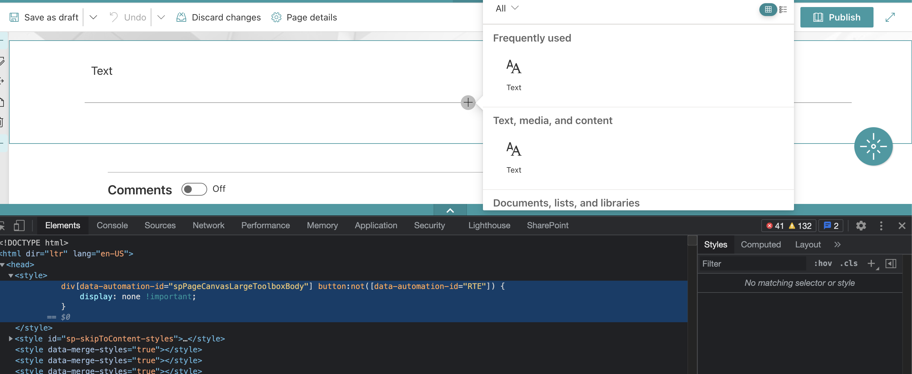

[](https://developer.android.com/)
[](https://github.com/zounasL/Fix-Hack-Learn---SharePoint) 
[](https://twitter.com/JoonasLahteinen)

# How to show SharePoint news in mobile app without multiple authentications flows
Currently if you use Oauth2 authentication flow you will get an access- and refresh token which are scoped to specifics services, like ex. Graph and SharePoint API. You can then use these tokens to get data from SharePoint through APIs.

To show content from SharePoint you need to have a ** SP Online Active Authentication Cookie** (spoidcrl) or **The root Federation Authentication** (rtFA) and **The Federation Authentication** (FedAuth) cookies. At the moment you are not able to get these cookies with the access token (or actually you can, but it contains a catch which we will cover in a moment).

## But Microsoft is doing this. How they then do it?
Microsoft also use Oauth2 method to authenticate the user to their mobile apps, so why they then can show SharePoint pages in their apps? Like ex. in Teams or SharePoint mobile app.

How Microsoft do this is that they call `_api/SP.Oauth.NativeClient/Authenticate` endpoint with the access token which is scoped to the tenant (scope ex. https://contoso.SharePoint.com). The endpoint will return a spoidcrl cookie which can be saved to platform webview cookie manager service. Now when user opens a SharePoint page the webview will get the spoidcrl cookie and if the cookie is valid SharePoint will show opened page in the webview.

Python test
```
import requests
# Example url
# https://login.microsoftonline.com/{TENANT ID OR COMMON}/oauth2/authorize?client_id={CLIENT ID}&response_type=code&redirect_uri={REDIRECT URI}&response_mode=query&resource={TENANT URL}

client_id = ''
redirect_uri= ''
code = ''
tenantRoot= ''

url = "https://login.microsoftonline.com/common/oauth2/token"

payload = 'client_id=' + client_id + '&redirect_uri=' + redirect_uri +'&code='+ code +'&resource=' + tenantRoot +'&grant_type=authorization_code'
headers = {
  'Content-Type': 'application/x-www-form-urlencoded'
}

response = requests.request("POST", url, headers=headers, data = payload)

response = response.json()

print(response)
print("\n")

url = tenantRoot + "/_api/SP.OAuth.NativeClient/Authenticate"

payload = {}
headers = {
  'Content-Type': 'application/x-www-form-urlencoded',
  'Authorization': 'Bearer ' + response['access_token'],
}

response = requests.request("POST", url, headers=headers, data = payload)

print(response.headers.get('Set-Cookie'))
print(response.text.encode('utf8'))
```

**But you said that you can’t get the cookie(s) with the access token.**
Yes, I did and here is the catch. The `_api/SP.Oauth.NativeClient/Authenticate` will only accept access tokens which are granted by specifics Microsoft client ids. So, in the end this is an artificial limitation from Microsoft side.

We tested couple of client ids which were able to call this endpoint:

* OneDrive Sync Engine ( ab9b8c07-8f02-4f72-87fa-80105867a763 ) 
* Teams ( 1fec8e78-bce4-4aaf-ab1b-5451cc387264 )

```
SP Oauth Native client endpoint documentation:
https://docs.microsoft.com/en-us/openspecs/SharePoint_protocols/ms-oauth2ex/fef8faa6-76fd-44d6-8cca-a5a69100c66a
```
```
There is also open user voice ticket related to this issue:
https://SharePoint.uservoice.com/forums/329220-SharePoint-dev-platform/suggestions/41745832-allow-3rd-party-native-clients-to-call-sp-oauth-na
```

## What can we do about it then?
Couple of things what we can try:

- [x] Get access token to the Microsoft client ids which can call the SP native endpoint
- [x] Have own restricted mobile news template
- [ ] Get needed JS libraries to render a web part

## Do we have any other options?
Well one thing what comes up to my mind is to use Security Token Service Endpoint to acquire Binary security token. When you have got the Binary security token you can call `https://{Tenant}.SharePoint.com/_vti_bin/idcrl.svc ` with the token to acquire SPOIDCRL cookie.
```
More info about this can be found in here:
https://techcommunity.microsoft.com/t5/microsoft-SharePoint-blog/SharePoint-online-active-authentication/ba-p/510052
```

# Get access token to the Microsoft client ids which can call the SP native endpoint
How this works is during login we do a normal login to our azure application (https://login.microsoftonline.com/{Tenant id}/oauth2/v2.0). After successful login we won’t close the Webview, instead we do another login request to the Microsoft client id which has capability to call that oauth native endpoint. In the end we have two different access tokens which we can use. We need the MS client access token only for the native endpoint.

**But doesn’t this require additional login because the client id is different**? No, it doesn’t require additional login, because microsoftonline use “ESTSAUTHPERSISTENT” cookie, which seems to be short living cookie and it grants you ability to authenticate without credentials.

Disadvantage with this kind of approach is that you can’t use any SSO apps like MS Authenticator, because authentication need to happen in webview which we can control. However, because we have full control of Webview it also means that we have access to users credentials which we can ex. save to keychain/credential storage. This way we can replicate the MS authenticator app functionality in our app.

## Demo
App folder: multiClient

Note: Edit Strings.xml to match your environment parameters


# Have own restricted mobile news template
When you check the `Clearbox Employee mobile app choices` result ( https://www.clearbox.co.uk/employee-mobile-app-choices-2021/ ) what all of those apps have common is that every apps are using relatively simple rich text editor for content creation.

What we can do to replicate this kind of content creations in SharePoint is following. Create a mobile news specific template and restrict web part usage in this page. Then in the mobile app we can do a custom rendering logic for the selected web parts which means that we don’t need to open it into browser. This way we can utilize SharePoint web parts in the news. Of course, we also can have like ex. external text editor PWA for content creation, but our focus was doing it in SharePoint.

**Cool, but how we get the data?** We can get the web part data by using SP search api and parse/decode the “CanvasContent” field. This field has all the information what is needed to do a custom rendering for the web part.

Reason why we want to do own template for news is to have better control what kind of web parts are supported in the mobile app. Disadvantage is that then we have two different news sources, but this might be feasible in cases where you want to have own news datatype for the mobile. One way maybe to tackle this is to have some kind of news converter which will duplicate created news and filters out web parts which are not supported.


Example css how to hide web parts from the toolbox
```
div[data-automation-id="spPageCanvasLargeToolboxBody"] button:not([data-automation-id="RTE"]) { display: none !important; }
```


App folder: CustomRendering

Note: Edit Strings.xml to match your environment parameters

Demo:


# Get needed JS libraries to render a web part
Idea for this was to use or replicate behaver of the SPComponentLoader class ( https://docs.microsoft.com/en-us/javascript/api/sp-loader/spcomponentloader?view=sp-typescript-latest ) which loads all needed files to render a web part. Unfortunately, we didn't had time to investigate this further.

